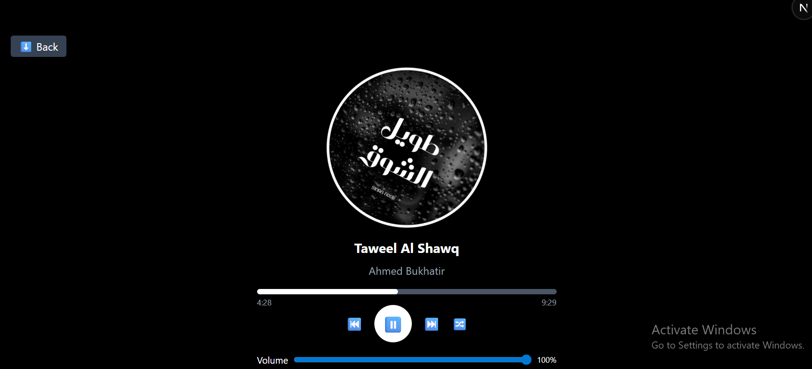

# 🎵 Music Player App

A modern, responsive **music player built with Next.js, React, and TypeScript**.  
Supports playlists, categories, search, mini & full player views, volume control, next/previous controls, shuffle, and a real-time progress bar.

## 🌟 Features

- **Full playlist view** with search and category filters.
- **Mini player** at the bottom when a song is playing.
- **Full player** view with big cover art, progress bar, and controls.
- **Play / Pause, Next / Previous, Shuffle** functionality.
- **Volume control** with percentage display.
- **Responsive and neat UI** with minimal scrolling.
- **Progress bar** showing how much of the song is played and remaining.
- **Professional and clean design** inspired by Spotify / YouTube Music.

## 🛠️ Tech Stack

- **Framework:** Next.js 13+ (`app` directory, client components)
- **Language:** TypeScript
- **Styling:** Tailwind CSS
- **State Management:** React `useState` / `useRef` / `useEffect`

## 📁 Project Structure

```

/app
/components
Player.tsx
Playlist.tsx
Search.tsx
/data
songs.ts
/public
/screenshots
Screenshotplaylist.png
Screenshot.png
/images (not included)
cover1.jpg, cover2.jpg ...
/music (not included)
song1.mp3, song2.mp3 ...

```

## 📸 Screenshots

**Playlist view:**  


**Full Player view:**  


> ⚠️ Note: Music files (`/public/music`) and cover images (`/public/images`) are **not included** due to repo size.  
> To run the app, add your own `.mp3` files and cover images with paths matching `songs.ts`.
